# 🤖 mcp-demo-spring-python

## 🧠 Application Agentique avec Spring AI, MCP Protocol, NodeJS, Python et LLMs (OpenAI, Claude, LLaMA)

---

### ❗ Problème à résoudre :

> **"Créer une architecture flexible et extensible d'agents IA capables d'interagir avec des outils externes via le protocole MCP, en multi-langage (Java, NodeJS, Python), pour permettre la résolution intelligente de requêtes complexes."**

---

### 🔍 Description

Cette application montre comment :

- Mettre en place des **serveurs MCP** (Spring Boot, NodeJS, Python)
- Intégrer un **client Spring AI** compatible avec Claude, LLaMA3.2 et OpenAI
- Créer un **agent intelligent** (`ToolCallbackProvider`, mémoire contextuelle, etc.)
- Appeler dynamiquement des **tools STDIO**
- **Tester via Swagger UI**, Postman ou Front Angular/Thymeleaf

---

### ✅ Fonctionnalités principales

- 📁 **Lecture / écriture fichiers** via `@modelcontextprotocol/server-filesystem`
- 🔁 **Communication STDIO** entre le client Java et les tools (NodeJS, Python)
- 🧠 **Utilisation de modèles LLM** en interaction avec des outils réels
- ✔️ **Test complet** avec Postman et Swagger
- 🎨 **Intégration UI** (Angular ou Thymeleaf)

---

### 🛠️ Stack technique

| Composant | Description |
|----------|-------------|
|  **Spring Boot / Spring AI** | Agent IA et orchestration |
| 🧠 **LLMs** | OpenAI (GPT-4), Claude, LLaMA |
| 🟢 **NodeJS** | Tools MCP (file-system) exécutés via NPX |
| 🐍 **Python** | Tools MCP exécutés via `uv` |
| 📦 **MCP Protocol** | Standardisé pour outils multilangages |
| 📬 **Postman / Swagger** | Test et documentation des endpoints |
| 🌐 **Angular / Thymeleaf** | Interface utilisateur (UI) |

---

### 📂 Structure du projet


---

### 📊 Diagramme de séquences (simplifié)


### 📊 Diagramme de flux du projet

```mermaid
flowchart TD
    A["🧑 Utilisateur (Swagger / Angular)"] -->|1. Saisie de question| B["🌐 API REST Spring (RestController)"]
    B -->|2. Transmet la requête| C["🧠 Agent IA (Spring AI)"]
    C -->|3. Construit prompt + contexte + tools| D["🧠 LLM (OpenAI / Claude / LLaMA)"]

    subgraph "🔁 MCP Client (Java Spring)"
        E["🔗 MCPClient"]
    end

    D -->|4. Choix d’un outil MCP| E
    E -->|5. Appel STDIO| F1["🟢 Serveur MCP Node.js"]
    E -->|5. Appel STDIO| F2["🐍 Serveur MCP Python"]

    F1 -->|6. Résultat JSON| E
    F2 -->|6. Résultat JSON| E

    E -->|7. Réponse brute| C
    C -->|8. Observation| D
    D -->|9. Réponse finale| C
    C -->|10. Transmet résultat| B
    B -->|11. Réponse affichée| A
```



## 🚀 Démarrage rapide

1. Clone du projet  
2. Configure `.env` avec ta clé OpenAI  
3. Lance le backend : `Spring Boot`  
4. Lance un outil via `npx` ou `uv`  
5. Teste via Swagger (`http://localhost:8066/swagger-ui.html`)

## 🧪 Exemple de requête

## Réponse
```json
POST /chat
{
  "query": "Crée un fichier nommé test.md avec le contenu Bonjour"
}

{
  "result": "Fichier test.md créé avec succès dans le répertoire autorisé"
}
```

